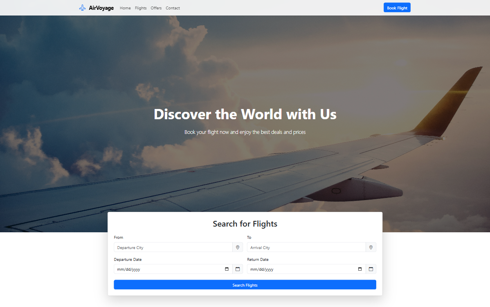

# ✈️ AirVoyage – Airline Booking Interface

**AirVoyage** is a frontend project for designing an airline booking system interface.  
It was built using **HTML**, **CSS**, **JavaScript**, and **Bootstrap** with a responsive and user-friendly design to display and book flight details.

---

## 🚀 Live Demo
🔗 [View Project Live](https://ahmednaderhq.github.io/AirVoyage/)

---

## 📷 Preview
  

---

## 📌 Features
- Responsive design that works on all devices.
- Booking form including flight and passenger details.
- Select departure and return dates.
- Display booking summary before submission.
- Built using **Bootstrap** for fast and consistent UI design.

---

## 🛠️ Technologies Used
- **HTML5** – Structure of the pages.
- **CSS3** – Styling and layout.
- **JavaScript (ES6+)** – Interactivity and data handling.
- **Bootstrap** – Responsive grid system, components, and utilities.
